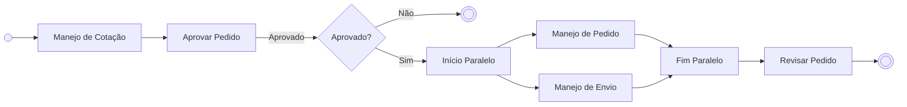
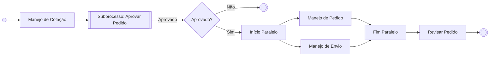
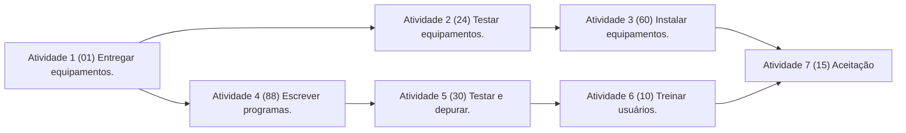
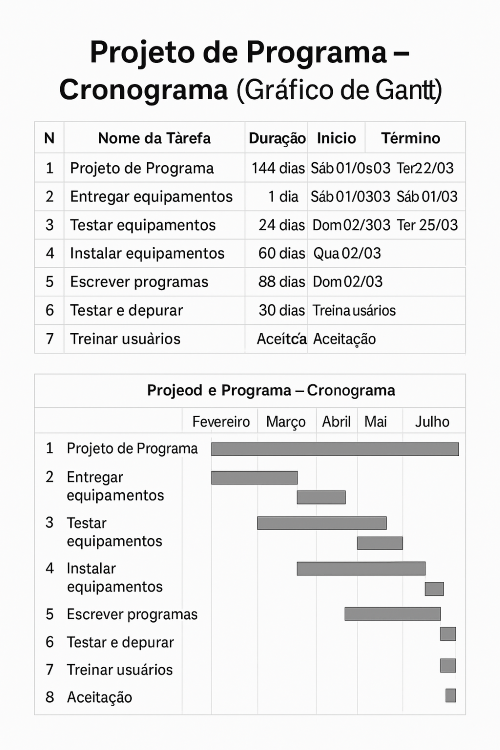

# Especificações do Projeto

> **Pré-requisitos**: Consulte a <a href="01-Documentação de Contexto.md"> Documentação de Contexto</a></span> para obter informações adicionais sobre o contexto do projeto.

Esta seção detalha a definição do problema e a ideia de solução a partir da perspectiva do usuário. Aqui, abordamos os diagramas de personas, histórias de usuários, requisitos funcionais e não funcionais, além das restrições do projeto.

A seguir, você encontrará uma visão geral do que será coberto, incluindo as técnicas e ferramentas utilizadas para elaborar as especificações do projeto.

## Personas

**Pedro Paulo** tem 26 anos, é arquiteto recém-formado e trabalha de forma autônoma. Seu objetivo é se especializar através de um mestrado fora do país. Ele adora viajar, é solteiro e sempre sonhou em fazer um intercâmbio. Atualmente, está à procura de uma agência que o ajude a encontrar universidades na Europa que aceitem alunos estrangeiros.

Enumere e detalhe as personas relacionadas ao seu projeto, utilizando os documentos e referências abaixo para ajudar na definição:

- Lembre-se de personalizar as descrições e detalhar as necessidades de cada persona de forma precisa.

## Histórias de Usuários

Com base na análise das personas, foram identificadas as seguintes histórias de usuários:

|EU COMO... `PERSONA`| QUERO/PRECISO ... `FUNCIONALIDADE` |PARA ... `MOTIVO/VALOR`                 |
|--------------------|------------------------------------|----------------------------------------|
|Usuário do sistema  | Registrar minhas tarefas           | Não esquecer de fazê-las               |
|Administrador       | Alterar permissões                 | Gerenciar as contas de maneira eficiente|

- As histórias de usuários ajudam a capturar os requisitos funcionais e não funcionais de forma clara. Se possível, agrupe as histórias por contexto para facilitar consultas futuras.

## Modelagem do Processo de Negócio

### Análise da Situação Atual

Descreva os problemas atuais que justificam a implementação da sua proposta. Se o sistema já estiver em operação, forneça o modelo atual. Caso contrário, explique como as tarefas seriam realizadas sem o uso de tecnologia.

### Descrição Geral da Proposta

Apresente sua proposta de solução, destacando os limites e as conexões com as estratégias e objetivos do negócio. Além disso, aponte as oportunidades de melhoria que sua solução oferece.

### Processo 1 – NOME DO PROCESSO

Apresente o nome do processo e as oportunidades de melhoria identificadas. Em seguida, insira o modelo do processo, utilizando o padrão BPMN.



### Processo 2 – NOME DO PROCESSO

Da mesma forma, apresente o nome e as oportunidades de melhoria para o processo 2. Inclua também o modelo BPMN do processo.



## Indicadores de Desempenho

Defina os principais indicadores de desempenho e estabeleça metas para o projeto. As informações necessárias para gerar esses indicadores devem ser capturadas no diagrama de classes, que será detalhado posteriormente.

Modelo sugerido:

| Indicador                    | Objetivos                                                              | Descrição                                                    | Cálculo     | Fonte dados           | Perspectiva                   |
|-----------------------------|------------------------------------------------------------------------|--------------------------------------------------------------|-------------|------------------------|-------------------------------|
| Percentual reclamações      | Avaliar quantitativamente as reclamações                              | Percentual de reclamações em relação ao total atendimento    |             | Tabela reclamações     | Aprendizado e Crescimento     |
| Taxa de Requisições abertas | Melhorar a prestação de serviços medindo a porcentagem de requisições | Mede % de requisições atendidas na semana                    | *100        | Tabela solicitações    | Processos internos            |
| Taxa de entrega de material | Manter controle sobre os materiais que estão sendo entregues          | Mede % de material entregue dentro do mês                    |             | Tabela Pedidos         | Clientes                      |

## Requisitos

A seguir, os requisitos funcionais e não funcionais detalham o escopo do projeto. Para definir as prioridades, use uma técnica de priorização de requisitos e explique como ela foi aplicada.

### Requisitos Funcionais

|ID    | Descrição do Requisito  | Prioridade | Responsável |
|------|-----------------------------------------|-----------|-----------|
|RF-001| Permitir que o usuário cadastre tarefas | ALTA      | Nome do Desenvolvedor      | 
|RF-002| Emitir um relatório de tarefas no mês   | MÉDIA     | Nome do Desenvolvedor      |

### Requisitos Não Funcionais

|ID     | Descrição do Requisito  |Prioridade |
|-------|-------------------------|-----------|
|RNF-001| O sistema deve ser responsivo para dispositivos móveis | MÉDIA | 
|RNF-002| O sistema deve processar requisições do usuário em no máximo 3 segundos | BAIXA |

Classifique os requisitos como funcionais (RF) ou não funcionais (RNF), e lembre-se de garantir que todas as histórias de usuário sejam cobertas. Os requisitos funcionais tratam de funcionalidades da aplicação, enquanto os não funcionais dizem respeito a aspectos técnicos, como desempenho ou usabilidade.

## Restrições

O projeto tem as seguintes restrições:

|ID| Restrição                                             |
|--|-------------------------------------------------------|
|01| O projeto deverá ser entregue até o final do semestre |
|02| Não pode ser desenvolvido um módulo de backend        |

Detalhe as restrições que limitam sua solução. As restrições muitas vezes determinam o que pode ou não ser feito durante o desenvolvimento.

## Diagrama de Casos de Uso

O diagrama de casos de uso é uma ferramenta essencial após a elicitação de requisitos. Ele oferece uma representação gráfica das interações entre os usuários e o sistema, identificando atores, casos de uso e seus relacionamentos.

## Matriz de Rastreabilidade

A matriz de rastreabilidade ajuda a mapear a relação entre os requisitos e outros artefatos, como objetivos de negócio. Ela facilita o acompanhamento e a verificação do cumprimento dos requisitos.

|       | MK   | RF-01 | RNF-01 | TC01 | TC02 | M100 | DC-01 | GV   | RF-02 |
|-------|------|-------|--------|------|------|------|--------|------|--------|
| MK    |      |       |        |      |      |      |        |      |        |
| RF-01 |      |       |        |      |      |      |        |      |        |
| RNF-01|      |       |        |      |      |      |        |      |        |
| TC01  |      |       |        |      |      |      |        |      |        |
| TC02  |      |       |        |      |      |      |        |      |        |
| M100  |      |       |        |      |      |      |        |      |        |
| DC-01 |      |       |        |      |      |      |        |      |        |
| GV    |      |       |        |      |      |      |        |      |        |
| RF-02 |      |       |        |      |      |      |        |      |        |

---

# Gerenciamento de Projeto

O gerenciamento de projeto, segundo o PMBoK v6, envolve dez áreas essenciais: Integração, Escopo, Cronograma, Custos, Qualidade, Recursos, Comunicações, Riscos, Aquisições e Partes Interessadas. Cada uma dessas áreas se inter-relaciona e é fundamental para o sucesso do projeto.

## Gerenciamento de Tempo

Ferramentas como diagramas e gráficos de Gantt ajudam a organizar as atividades e a estimar prazos de conclusão. Essas ferramentas são essenciais para o controle eficiente do cronograma.

**Exemplo:**
> #### Diagrama de Rede de Atividades
> - Este diagrama representa a sequência de atividades para a entrega, instalação e aceitação de equipamentos e software.
> #### Fluxo de Atividades:



> #### Projeto de Programa – Planejamento e Cronograma

Este projeto visa o desenvolvimento e entrega de um programa completo, desde a aquisição de equipamentos até a aceitação final do sistema pelos usuários. Abaixo está o cronograma detalhado com todas as etapas, durações e dependências.

---

#### Cronograma de Atividades

| Nº | Nome da Tarefa           | Duração   | Início       | Término      | Predecessores |
|----|--------------------------|-----------|--------------|--------------|----------------|
| 1  | **Projeto de Programa**  | 144 dias  | Sáb 01/03/03 | Ter 22/07/03 | —              |
| 2  | Entregar equipamentos    | 1 dia     | Sáb 01/03/03 | Sáb 01/03/03 | —              |
| 3  | Testar equipamentos      | 24 dias   | Dom 02/03/03 | Ter 25/03/03 | 2              |
| 4  | Instalar equipamentos    | 60 dias   | Qua 26/03/03 | Sáb 24/05/03 | 3              |
| 5  | Escrever programas       | 88 dias   | Dom 02/03/03 | Qua 28/05/03 | 2              |
| 6  | Testar e depurar         | 30 dias   | Qui 29/05/03 | Sex 27/06/03 | 5              |
| 7  | Treinar usuários         | 10 dias   | Sáb 28/06/03 | Seg 07/07/03 | 6, 4           |
| 8  | Aceitação                | 15 dias   | Ter 08/07/03 | Ter 22/07/03 | 7              |

---

> #### Dependências entre Tarefas

- **Tarefa 3** depende da conclusão da tarefa 2.
- **Tarefa 4** depende da tarefa 3.
- **Tarefa 5** também depende da tarefa 2.
- **Tarefa 6** só inicia após a tarefa 5.
- **Tarefa 7** depende das tarefas 4 e 6.
- **Tarefa 8** depende da tarefa 7.

---

> #### Linha do Tempo Simplificada

```plaintext
Meses →     Fev   Mar    Abr    Mai    Jun    Jul
            |-----|------|------|------|------|-----|
Projeto     [############## Projeto de Programa ###############]
Equipamentos       [Entregar equipamentos]
Teste Equip.        [ Testar equipamentos     ]
Instalação           [     Instalar equipamentos          ]
Programação         [       Escrever programas           ]
Testes                                     [ Testar e depurar   ]
Treinamento                                        [ Treinar usuários ]
Aceitação                                                  [ Aceitação  ]
```



## Gerenciamento de Equipe

Uma gestão de equipe bem organizada melhora a produtividade do projeto. Ferramentas de controle de tarefas são fundamentais para garantir o bom andamento do trabalho em equipe.

> - #### CRONOGRAMA DE PROJETO SIMPLES - 2025

| Nome da Equipe       | Atividade                             | Data de Início   | Data de Término | Observações                      |
|----------------------|---------------------------------------|------------------|-----------------|----------------------------------|
| **Equipe de Marketing** | Definir Expectativas do Cliente       | 07-Ago-2017      | 11-Ago-2017     |                                  |
|                      | Formalizar Abordagem                  | 14-Ago-2017      | 25-Ago-2017     |                                  |
|                      | Elaborar um Plano de Trabalho         | 21-Ago-2017      | 01-Set-2017     |                                  |
|                      | Contratual: Receber Feedback          | 04-Set-2017      | 08-Set-2017     |                                  |
|                      | **MS: Enviar plano de trabalho**      | 11-Set-2017      | 15-Set-2017     | Marco (MS)                       |
| **Grupo de Interface** | Concordar com um Plano                | 14-Ago-2017      | 18-Ago-2017     |                                  |
|                      | Concordar com a Abordagem             | 21-Ago-2017      | 25-Ago-2017     |                                  |
|                      | Configurar GUI                        | 28-Ago-2017      | 08-Set-2017     |                                  |
|                      | Contratual: Receber Feedback          | 11-Set-2017      | 15-Set-2017     |                                  |
| **Equipe de QM**      | Testar Valores #1                     | 04-Set-2017      | 29-Set-2017     |                                  |
|                      | Contratual: Receber Feedback          | 02-Out-2017      | 06-Out-2017     |                                  |
|                      | **MS: Enviar plano de relatório de testes** | 09-Out-2017 | 13-Out-2017     | Marco (MS)                       |

## Gestão de Orçamento

O orçamento do projeto deve ser gerido com base nos dados do escopo e do tempo, além dos custos envolvidos em cada etapa.

> - #### ORÇAMENTO
| Recursos Necessários | Valor (R$)      |
|----------------------|-----------------|
| Recursos humanos     | 200.000,00      |
| Hardware             | 25.000,00       |
| Rede                 | 2.400,00        |
| Software             | 24.000,00       |
| Serviços             | 5.000,00        |
| **TOTAL**            | **256.400,00**  |
