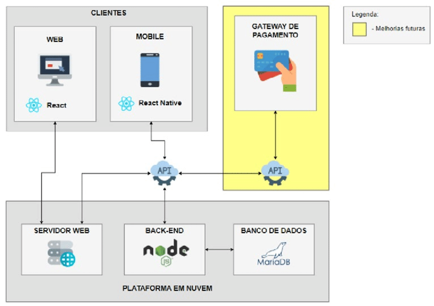

# Arquitetura da Solução

**Pré-requisito:** Consulte o documento <a href="03-Projeto de Interface.md"> Projeto de Interface</a> para melhor compreensão da integração visual com a arquitetura da aplicação.

Este documento descreve a estrutura da solução em termos de componentes principais, modelagem de dados, tecnologias envolvidas e ambiente de hospedagem.

---

## Diagrama de Classes

O diagrama de classes define a estrutura estática do sistema, especificando as classes que compõem a aplicação, seus atributos, métodos e os relacionamentos entre elas. Ele serve como base para a implementação orientada a objetos e para a definição de responsabilidades de cada componente no sistema.

> **Referências úteis:**
>
> - [Diagramas de Classes - IBM](https://www.ibm.com/docs/pt-br/rational-soft-arch/9.6.1?topic=diagrams-class)
> - [O que é um diagrama de classe UML? - Lucidchart](https://www.lucidchart.com/pages/pt/o-que-e-diagrama-de-classe-uml)

---

## Modelo Entidade-Relacionamento (ER)

O modelo ER descreve conceitualmente os dados manipulados pela aplicação, representando as entidades do domínio e seus relacionamentos. Ele é essencial para garantir a integridade lógica da base de dados e para facilitar a comunicação entre desenvolvedores e analistas.

> **Referência:**
>
> - [Como fazer um diagrama entidade-relacionamento - Lucidchart](https://www.lucidchart.com/pages/pt/como-fazer-um-diagrama-entidade-relacionamento)

---

## Esquema Relacional

Tradução do Modelo ER para o modelo lógico, o esquema relacional organiza os dados em tabelas e define as chaves primárias, estrangeiras e restrições de integridade. Esse artefato é crucial para a implementação do banco de dados relacional.

> **Referência:**
>
> - [Criando um modelo relacional - IBM](https://www.ibm.com/docs/pt-br/cognos-analytics/10.2.2?topic=designer-creating-relational-model)

---

## Modelo Físico

Deve ser entregue um arquivo `banco.sql` contendo os scripts SQL necessários para a criação das estruturas do banco de dados. Este arquivo deve ser incluído na pasta `src/bd`.

---

## Tecnologias Utilizadas

Liste aqui todas as tecnologias adotadas na implementação da solução, como linguagens de programação, frameworks, bibliotecas, IDEs, serviços web, entre outros.

Adicionalmente, inclua um diagrama ou fluxograma que ilustre o fluxo de interação do usuário com o sistema e como os componentes tecnológicos estão integrados, desde a entrada até o retorno da resposta.

---

## Hospedagem

Descreva o ambiente de hospedagem escolhido para disponibilizar a aplicação (e.g., Heroku, GitHub Pages, Repl.it), bem como o processo de publicação e atualização da plataforma.

> **Links úteis:**
>
> - [Publicando com GitHub Pages](https://pages.github.com/)
> - [Colaboração com Repl.it](https://repl.it/)
> - [Getting Started with Heroku](https://devcenter.heroku.com/start)
> - [Publicando no Heroku com Python](http://pythonclub.com.br/publicando-seu-hello-world-no-heroku.html)

---

## Qualidade de Software

A qualidade de software é um fator crítico no desenvolvimento e entrega de soluções robustas, manuteníveis e escaláveis. A norma ISO/IEC 25010 define oito características principais de qualidade e suas subcaracterísticas.

Sua equipe deve selecionar as subcaracterísticas mais relevantes para o projeto e justificar a escolha com base nos objetivos do sistema e nas necessidades dos usuários. Também é importante definir métricas que permitam avaliar essas qualidades ao longo do desenvolvimento.

> **Referências:**
>
> - [ISO/IEC 25010:2011 - Modelos de Qualidade](https://www.iso.org/standard/35733.html/)
> - [Análise da ISO 9126 – NBR 13596](https://www.tiespecialistas.com.br/analise-sobre-iso-9126-nbr-13596/)
> - [Qualidade de Software - DevMedia](https://www.devmedia.com.br/qualidade-de-software-engenharia-de-software-29/18209/)
