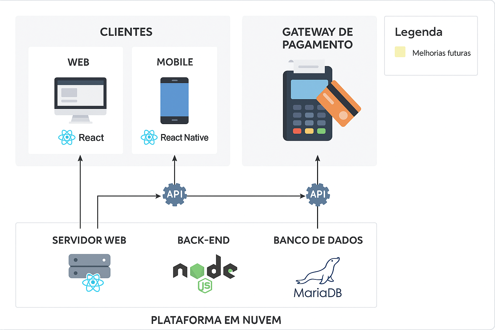
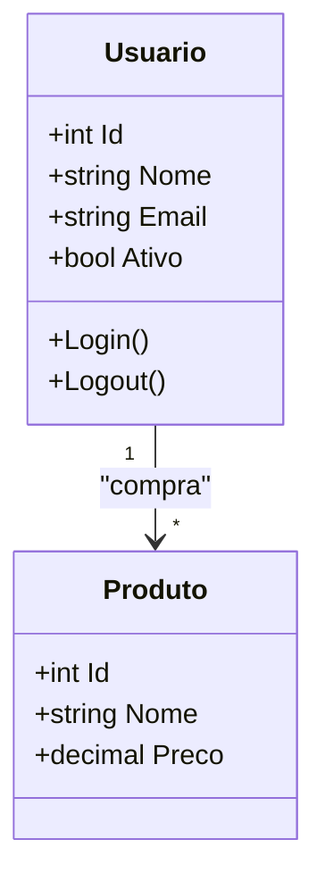
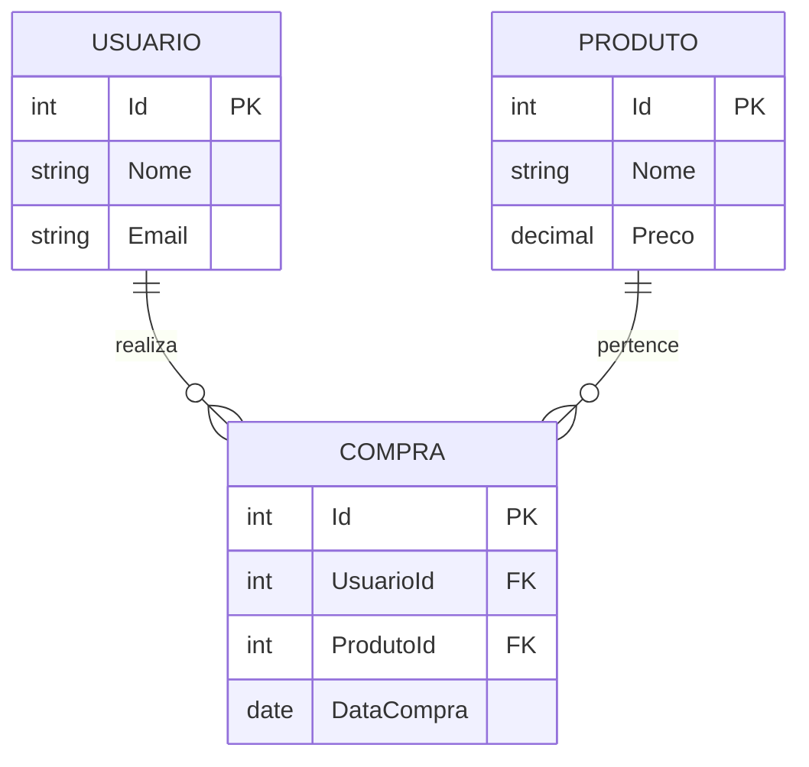

# Arquitetura da Solução

> **Pré-requisito:** Consulte o documento [Projeto de Interface](04-Projeto%20de%20Interface.md) para compreender a integração visual com a arquitetura da aplicação.

Este documento descreve a estrutura da solução, abordando os principais componentes, modelagem de dados, tecnologias envolvidas e ambiente de hospedagem.



---

## Diagrama de Classes

O **diagrama de classes** define a estrutura estática do sistema, especificando classes, atributos, métodos e relacionamentos.

**Exemplo:**



_Legenda:_ Um usuário pode comprar vários produtos.

---

## Modelo Entidade-Relacionamento (ER)

O **Modelo ER** descreve as entidades e seus relacionamentos, sendo essencial para o projeto do banco de dados.

**Exemplo:**



_Legenda:_ Um usuário pode realizar várias compras; uma compra está associada a um produto.

---

## Esquema Relacional

O **esquema relacional** traduz o modelo ER para o banco de dados relacional.

**Exemplo:**

```sql
CREATE TABLE Usuario (
    Id INT PRIMARY KEY,
    Nome VARCHAR(100),
    Email VARCHAR(100)
);

CREATE TABLE Produto (
    Id INT PRIMARY KEY,
    Nome VARCHAR(100),
    Preco DECIMAL(10,2)
);

CREATE TABLE Compra (
    Id INT PRIMARY KEY,
    UsuarioId INT,
    ProdutoId INT,
    DataCompra DATE,
    FOREIGN KEY (UsuarioId) REFERENCES Usuario(Id),
    FOREIGN KEY (ProdutoId) REFERENCES Produto(Id)
);
```

_Observação:_ Use `NOT NULL`, índices e constraints adicionais conforme necessário.

---

## Modelo NoSQL (Banco de dados não relacional)

Este documento apresenta uma modelagem NoSQL equivalente ao esquema relacional fornecido, utilizando o estilo de documentos do MongoDB.

---

**Exemplo:**

> **Coleção: `usuarios`**

```json
{
  "_id": ObjectId("644e8f3c9b1d2a001b3e5a7f"),
  "nome": "João da Silva",
  "email": "joao@email.com"
}
```

**Exemplo:**

> **Coleção: `produtos`**

```json
{
  "_id": ObjectId("644e8f6d9b1d2a001b3e5a81"),
  "nome": "Teclado Mecânico",
  "preco": 250.00
}
```

**Exemplo:**

> **Coleção: `compras`**

```json
{
  "_id": ObjectId("644e8f819b1d2a001b3e5a83"),
  "usuario_id": ObjectId("644e8f3c9b1d2a001b3e5a7f"),
  "produto_id": ObjectId("644e8f6d9b1d2a001b3e5a81"),
  "data_compra": "2024-03-15"
}
```

**Exemplo:**

> Com dados embutidos

```json
{
  "_id": ObjectId("644e8f819b1d2a001b3e5a83"),
  "usuario": {
    "_id": ObjectId("644e8f3c9b1d2a001b3e5a7f"),
    "nome": "João da Silva",
    "email": "joao@email.com"
  },
  "produto": {
    "_id": ObjectId("644e8f6d9b1d2a001b3e5a81"),
    "nome": "Teclado Mecânico",
    "preco": 250.00
  },
  "data_compra": "2024-03-15"
}
```

---

## Modelo Físico

O modelo físico será entregue em um arquivo `banco.sql` contendo:

- Criação de tabelas
- Índices
- Constraints de integridade
- Inserts iniciais (opcional)

**Exemplo de organização de arquivos:**

```
src/
└── bd/
    └── banco.sql
```

---

## Tecnologias Utilizadas

Liste aqui todas as tecnologias adotadas:

| Categoria      | Tecnologia                           |
| -------------- | ------------------------------------ |
| Linguagem      | C# (.NET Core), JavaScript (Next.js) |
| Banco de Dados | MongoDB                              |
| Frontend       | Next.js                              |
| Backend        | ASP.NET Core Web API                 |
| Hospedagem     | Vercel (Frontend) e Azure (Backend)  |
| Ferramentas    | Postman, Docker, VSCode, GitHub      |

**Exemplo de fluxo de interação:**


---

## Hospedagem

**Frontend:** hospedado na [Vercel](https://vercel.com/)

**Backend:** hospedado na [Microsoft Azure](https://azure.microsoft.com/)

**Processo de Publicação:**

1. Configurar repositórios no GitHub.
2. Integrar Vercel com repositório do Frontend.
3. Configurar App Service no Azure para o Backend.
4. Definir pipelines de CI/CD.
5. Configurar variáveis de ambiente necessárias.

**Exemplo de variáveis de ambiente:**

- `MONGO_DB_URI`
- `JWT_SECRET`
- `API_URL`

---

## Qualidade de Software

A qualidade é baseada na norma **ISO/IEC 25010**, focando em:

| Característica   | Subcaracterística   | Justificativa                                        |
| ---------------- | ------------------- | ---------------------------------------------------- |
| Funcionalidade   | Acurácia Funcional  | Assegurar que as funções atendam os requisitos.      |
| Confiabilidade   | Tolerância a Falhas | Garantir estabilidade em condições adversas.         |
| Usabilidade      | Acessibilidade      | Tornar a aplicação utilizável por todos os públicos. |
| Eficiência       | Tempo de Resposta   | Minimizar atrasos na resposta ao usuário.            |
| Manutenibilidade | Modificabilidade    | Facilitar futuras correções e melhorias.             |
| Portabilidade    | Adaptabilidade      | Suporte a múltiplas plataformas e navegadores.       |

**Métricas propostas:**

- **Taxa de Erro:** quantidade de erros por semana.
- **Tempo Médio de Resposta:** máximo de 2 segundos para ações críticas.
- **Cobertura de Testes Unitários:** mínimo de 80%.
- **Índice de Acessibilidade (Lighthouse):** mínimo de 90%.

---

> **Observação Final:**  
> Este documento deve ser mantido atualizado conforme a evolução da arquitetura e tecnologias da solução.
